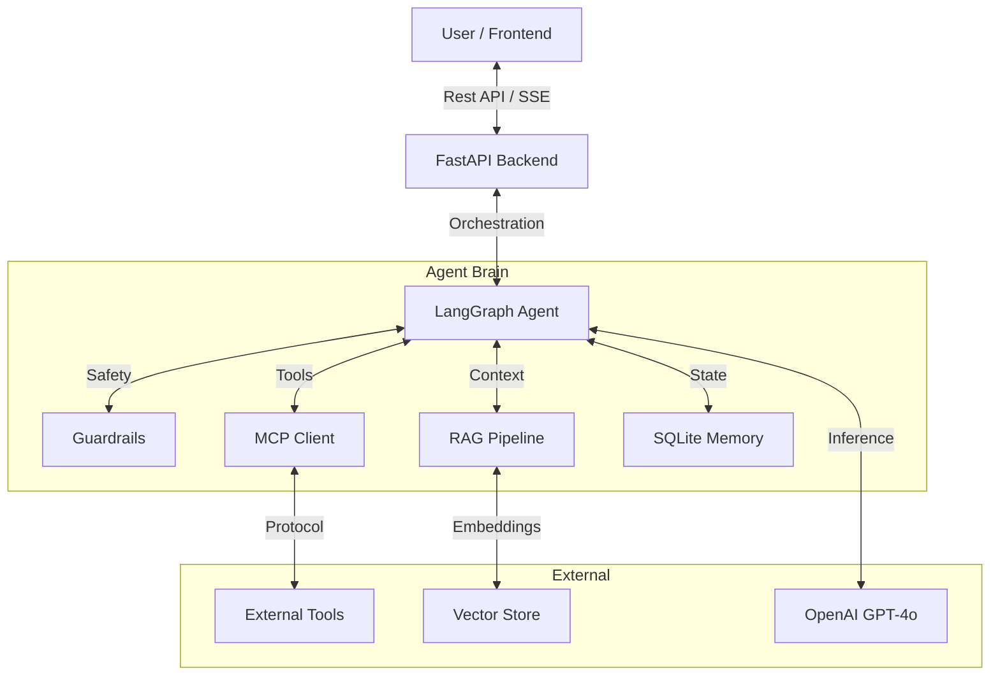

# AgentForge Boilerplate 🚀

**The Ultimate Full-Stack AI Agent Starter Kit**


AgentForge is a production-ready boilerplate for building advanced AI agents. It combines the power of **LangGraph** for orchestration, **RAG** for knowledge retrieval, and **MCP (Model Context Protocol)** for standardized tool integration—all wrapped in a modern **FastAPI** backend and **React** frontend..


## ✨ Key Features

- **🤖 LangGraph Agent**: State-of-the-art agent orchestration with state management.
- **📚 RAG Pipeline v2**: Advanced retrieval with semantic chunking, re-ranking, and hybrid search.
- **🔌 MCP Integration**: Full support for Anthropic's Model Context Protocol (Client & Server).
- **🛡️ Guardrails**: Input/Output validation for safety, privacy (PII redaction), and quality.
- **⚡ Full-Stack**:
  - **Backend**: FastAPI with async support and streaming responses.
  - **Frontend**: Modern React (Vite) with TailwindCSS and markdown rendering.
- **🧠 Memory**: Persistent user memories using SQLite.
- **🔍 Web Search**: Integrated free web search via DuckDuckGo and Brave.

## 🏗️ Architecture Overview



## 🚀 Getting Started

### Prerequisites

- Python 3.10+
- Node.js 18+
- OpenAI API Key

### 1. Clone & Setup

```bash
git clone https://github.com/yourusername/agentforge.git](https://github.com/jadenitishraj/Agent-langchain-rag-mcp-tools-boilerplate.git
cd agentforge
```

### 2. Backend Setup

```bash
# Create virtual environment
python -m venv venv
source venv/bin/activate  # On Windows: venv\Scripts\activate

# Install dependencies
pip install -r requirements.txt

# Configure environment
cp .env.example .env
# Edit .env and add your OPENAI_API_KEY
```

### 3. Frontend Setup

```bash
cd frontend
npm install
```

### 4. Index the Codebase (RAG)

Make the agent self-aware by indexing the codebase:

```bash
# From root directory
source venv/bin/activate
python scripts/index_codebase.py
```

### 5. Run Everything

You can run the components separately:

**Backend:**

```bash
uvicorn main:app --reload --port 8000
```

**Frontend:**

```bash
cd frontend
npm run dev
```

Visit **http://localhost:5173** to chat with your agent!

## 📂 Project Structure

- **`langraph/`**: Core agent logic, state graph, and router.
- **`rag/`**: Retrieval Augmented Generation pipeline (Loader -> Embedder -> Store).
- **`mcp_servers/`**: Model Context Protocol servers (Search, SQLite).
- **`guardrails/`**: Input/Output safety checks (PII, Toxicity, Hallucination).
- **`frontend/`**: React application with TailwindCSS.
- **`tools/`**: Custom tools (Memory, Contact).

## 🛠️ Customization

### Adding a New Tool

1. Define your tool in `tools/my_tool.py` using `@tool` decorator.
2. Add it to `ALL_TOOLS` in `tools/__init__.py`.
3. The agent will automatically detect and use it!

### Modifying the System Prompt

Edit `langraph/agent.py` and update the `SYSTEM_PROMPT` variable to change the agent's personality and instructions.

## 🤝 Contributing

Contributions are welcome! Please read `CONTRIBUTING.md` for details.

## 📄 License

MIT License - feel free to use this boilerplate for your own projects!

## 🚀 Agent V2: Multi-Agent Orchestrator

The system now includes an advanced **Multi-Agent Architecture** (`agent_v2.py`) that replaces the single-node agent with a team of specialized AI workers.

### 🏗️ Architecture

The **Orchestrator** plans the execution and delegates tasks to parallel agents. The **Combiner** synthesizes their reports, and a **Verifier** quality-checks the result.

    VerifierAgent -- Rejected --> CombinerAgent

    OutputGuardrails --> FinalOutput

```

### ⚡ Key Features

1.  **Orchestrator**: The "Mastermind" that coordinates the workflow.
2.  **True Parallel Execution**:
    - **History Agent**: Summarizes conversation context.
    - **RAG Agent**: Retrieves code/docs from the vector database.
    - **Memory Agent**: Fetches user preferences and facts.
    - **Web Agent**: Searches the internet for real-time info.
    - _All these run simultaneously for maximum speed._
3.  **Combiner Agent**: Synthesizes conflicting or distributed information into a single, cohesive answer.
4.  **Verifier Agent**: Acts as a QA Lead, critiquing the draft and requesting improvements if needed.
5.  **Streaming**: Manual orchestration allows real-time token streaming from the Combiner Agent to the UI.

## 🧠 Gen AI Best Practices

### ⚡ Semantic Caching (Latent Optimization)
To reduce costs and latency, the system implements **Semantic Caching** using Qdrant.
- **How it works**: Before querying the LLM, the system embeds the user's question and searches for similar past queries (Threshold: `0.70`).
- **Benefit**: If a similar question was asked before, the cached response is returned **instantly** (< 0.5s), avoiding expensive LLM calls.

### 🔄 RLHF Feedback Loop (Data Flywheel)
The system now supports **Reinforcement Learning from Human Feedback (RLHF)** data collection.
- **Feedback API**: `/feedback` endpoint allows users to rate responses (Thumbs Up/Down).
- **Storage**: Feedback is stored in the database (`Feedback` table) to be used for future fine-tuning or RAG evaluation.
```
